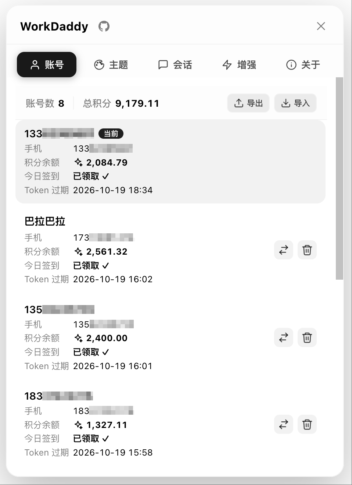

# WorkDaddy

> **WorkBuddy 的多账号 · 主题 · 增强工具集**
> 本机回环 CDP 注入 · 不改官方安装包

一个基于 **Chrome DevTools Protocol (CDP)** 的 [WorkBuddy](https://www.workbuddy.cn/) 桌面端增强工具。
零侵入、零重签名——只把界面组件注入到正在运行的 WorkBuddy 渲染进程里。


---

## 演示

<p align="left">
  
</p>


---

## 它能做什么

- **方便切换账号**：每个 WorkBuddy 账号独立备份，点一下就切，再也不用每次扫码。
- **账号导入导出**：把全部账号备份加密导出，在另一台电脑安装 WorkDaddy 后一键导入，方便电脑之间迁移账号。
- **自动领每日积分**：打开面板即对全部账号静默签到，幂等缓存，不打断你。
- **暂存提示词**：输入框边上一键把草稿「暂存」到待发送队列——图片 / 文件 / 引用原样保留，择机发送。
- **切换精美主题**：内置毛玻璃官方主题，多套预设壁纸，支持自定义壁纸。
- **账号间会话迁移**：把 A 账号的整段历史会话一键复制到 B 账号，跨账号继续接龙。
- **强化决策弹窗**：WorkBuddy 让你选/确认时，弹窗来点而不是文本询问（省得打字）。
- **防止电脑休眠**：睡前任务未完成，开启休眠模式，任务结束后自动切换成允许休眠。

---

## 安装

### macOS

1. 在 [Releases](../../releases) 下载最新 `WorkDaddy-x.y.z.dmg`
2. 打开 dmg，把 `WorkDaddy.app` 拖进 **应用程序** 文件夹
3. 第一次打开如果遇到「无法打开，因为 Apple 无法检查恶意软件」：
   1. 打开「系统设置 → 隐私与安全性」
   2. 在「WorkDaddy 已被阻止」处点 **仍要打开**
   3. 输入开机密码确认
   

4. 双击 `WorkDaddy.app` 启动：它会自带守护进程并把组件注入到 WorkBuddy 右下角
5. 看到机器人按钮？**搞定**。


### Windows

1. 在 [Releases](../../releases) 下载最新 `WorkDaddy-x.y.z-win64.zip`
2. **解压到桌面以外的文件夹，双击一键安装脚本 `Install-WorkDaddy.cmd`**，安装后即可关闭该窗口
3. 以后只需双击桌面的 WorkDaddy 图标；正常用户目录安装无需管理员权限，也不会弹出命令行黑框
4. 几秒后会自动打开 WorkBuddy/WorkBuddyAI，看到右下角机器人按钮即成功
5. 如需排障，可手动运行安装目录里的 `scripts\launcher.cmd`


### 从源码运行（开发者）

```bash
git clone https://github.com/babygoton/WorkDaddy.git
cd WorkDaddy
bash scripts/install.sh        # 创建备份目录 + 启动守护进程
bash scripts/relaunch-with-cdp.sh   # 把 WorkBuddy 切换到调试模式（端口 9222）
```

`install.sh` 做了：

- 创建 `~/Library/Application Support/WorkDaddy` 备份目录
- 首次启动自动兼容迁移旧版 `~/Library/Application Support/HelloBuddy/accounts` 账号备份（旧目录保留不删除）
- 首次备份当前 WorkBuddy 账号
- 注册 launchd 守护进程（登录自启、崩溃拉起）
- 立即启动后台守护进程
- 打开管理界面 `http://127.0.0.1:47832`

> 若从 WorkBuddy 应用内执行安装，launchd 注册可能失败——这属正常。
> 此时守护进程已在后台运行；如需开机自启在「终端」手动执行：
>
> ```bash
> launchctl bootstrap gui/$(id -u) ~/Library/LaunchAgents/com.workbuddy.workdaddy.plist
> ```

---

## 原理

**CDP 注入 · 不改官方安装包**

```
┌─────────────┐  --remote-debugging-port=9222  ┌──────────────┐
│  WorkBuddy  │ <───────────────────────────> │  WorkDaddy   │
│  (Electron) │       Chrome DevTools          │   daemon.js  │
│             │        Protocol (CDP)          │              │
│  渲染进程    │  ←── Runtime.evaluate ────     │  HTTP :47832 │
│  右下角     │      注入 inject.js            │  本地 API    │
└─────────────┘                                └──────────────┘
```

1. **不修改 WorkBuddy 二进制**：用 `launcher` 启动 WorkBuddy 时多带一个 `--remote-debugging-port=9222` 参数，**二进制与签名原封不动**。
2. **守护进程通过 CDP 连接 WorkBuddy**：监听登录/认证网络事件 + 文件监听兜底，每次登录/刷新令牌都把当前登录信息按 `account.uid` 备份到稳定目录。
3. **注入界面组件**：`Runtime.evaluate` 把 `inject.js` 推到渲染进程执行，在右下角渲染机器人按钮 + 弹出的 4 标签页面板（账号 / 主题 / 会话 / 增强） + 关于页。
4. **本地 HTTP API**：daemon 在 `127.0.0.1:47832` 起服务，组件通过 fetch 调用（账号切换、主题应用、签到、决策弹窗开关、休眠控制等）。
5. **零远程通信**：所有数据在本地回环，不向任何服务器上报。

> 为什么用 CDP 而不是官方插件机制：直接面向运行中的应用实例，事件级感知登录变化，
> 主动注入界面与样式补丁，**官方升级 WorkBuddy 后只要界面没大改就照常工作**。

---

## 使用

### 面板

WorkBuddy 右下角的机器人按钮 → 弹出面板 → 选你要的操作：

| Tab      | 能做什么                                                |
| -------- | ------------------------------------------------------- |
| **账号** | 列出所有已备份账号（昵称 / 手机 / 积分 / Token 过期），支持加密导入导出 |
| **主题** | 切换主题、自定义背景图、调整毛玻璃模糊度                |
| **会话** | 按时间/账号筛选会话，跨账号复制/迁移                    |
| **增强** | 决策弹窗开关 + 电脑休眠策略                             |
| **关于** | 版本、原理、平台、许可、仓库、运行时信息                |

**暂存提示词**：输入框有内容时，操作栏左侧会出现一个「标签」圆钮——hover 展开为「暂存提示词」。
点它把当前草稿（文字、图片、文件、引用等**完整原样**）挂进 WorkBuddy 自带的待发送队列，并自动暂停队列自动发送；
消息不会自己发出去，随时可以「立刻发送 / 编辑 / 删除」。入队后输入框自动清空，按会话独立存储，切换账号/会话不丢失。

### 账号迁移到其他电脑

在账号页右上角使用「导出」和「导入」按钮即可迁移全部账号：

1. 在旧电脑打开 WorkDaddy 账号页，点击「导出」，保存生成的 `WorkDaddy-账号导出-YYYY-MM-DD.json` 文件。
2. 用安全方式把导出文件传到新电脑，并在新电脑安装、启动 WorkDaddy。
3. 打开账号页点击「导入」，选择导出文件；导入完成后即可在账号列表中切换恢复的账号。

导出文件中的账号备份使用 AES-256-GCM 加密，内置导入密钥为 `workdaddy`。文件仍然包含可恢复登录状态的 token，请像保护密码一样安全保存和传输，迁移完成后及时删除不再需要的副本。


## 安全与隐私

- **零远程通信**：所有组件在 `127.0.0.1` 本地回环，**不向任何服务器上报任何数据**。
- **登录信息含明文 token**：备份目录权限 `700`、文件 `600`；请勿上传/分享。
- **token 会过期**：长时间不用的账号切换后可能需重新登录。
- **不改 WorkBuddy 安装包**：仅启动时多带 `--remote-debugging-port` 参数，二进制、签名原封不动。
- **debug 端口 = 仅本机**：`9222` 只绑定 loopback，不会被同 WiFi 其他人访问到。

完整威胁模型见 [`SECURITY.md`](SECURITY.md)（可选；未提供时本节即为完整说明）。

---

## 许可与声明

本项目采用 **[GNU Affero General Public License v3.0](LICENSE)** 开源（`SPDX-License-Identifier: AGPL-3.0-or-later`）。

- 本项目仅面向本机运行的 WorkBuddy 桌面端做界面与体验增强，**与 WorkBuddy 官方无隶属关系**。
- WorkBuddy、其商标、官方资源归其权利人所有；本项目未获得其官方授权或认可。
- 第三方主题、壁纸、背景图等素材仅作演示，商用前请自行确认权利。

---

## 兼容性说明

- macOS 11+（Big Sur 起），Apple Silicon 与 Intel 均支持
- Windows 10/11 64 位（需 WorkBuddy Windows 版；node 使用 WorkBuddy 自带托管运行时或 PATH 中的 Node 18+）
- WorkBuddy 桌面端 0.6.6+（daemon 与 inject 同步升级后覆盖更新）

## 社区支持

[Linux](https://linux.do/)
